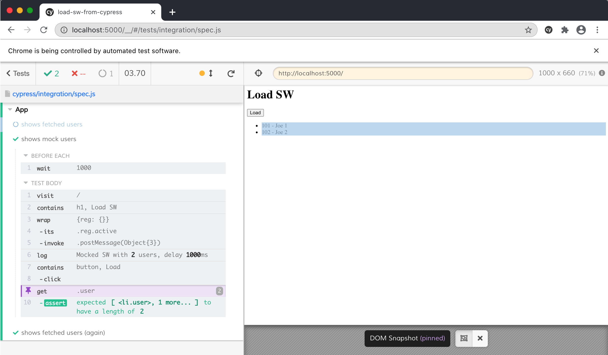

# load-sw-from-cypress

Playing with network proxy defined in a ServiceWorker like [service-turtle](https://github.com/bahmutov/service-turtle) and [msw](https://github.com/mswjs/msw), but loading the SW from Cypres

See [cypress/integration/spec.js](cypress/integration/spec.js)
